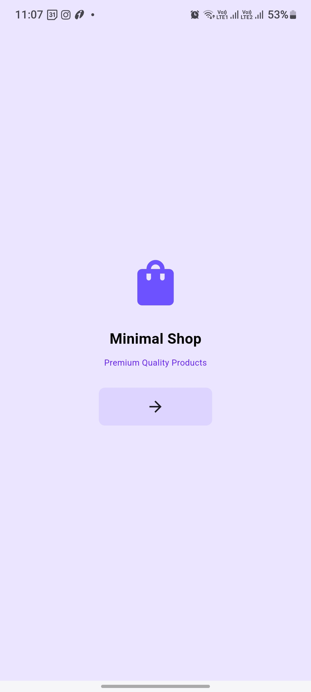
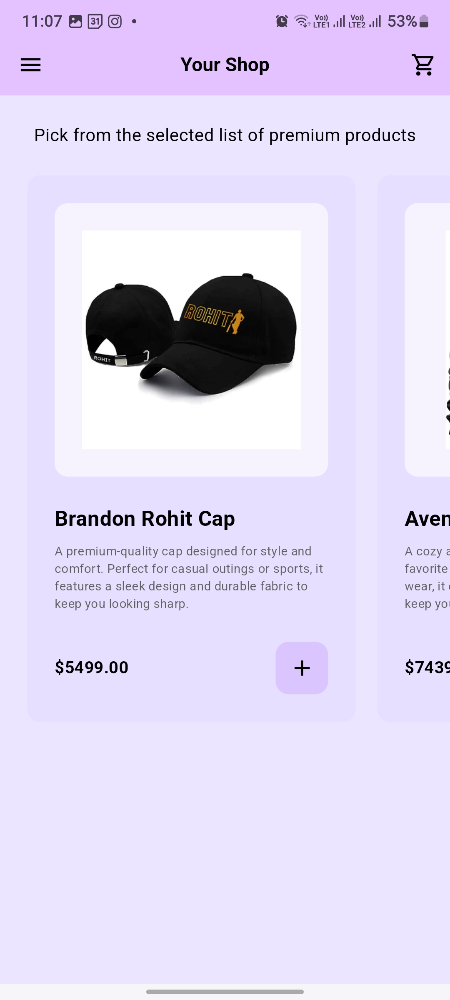
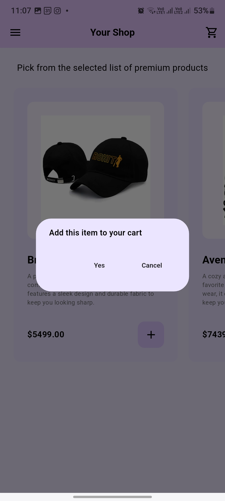
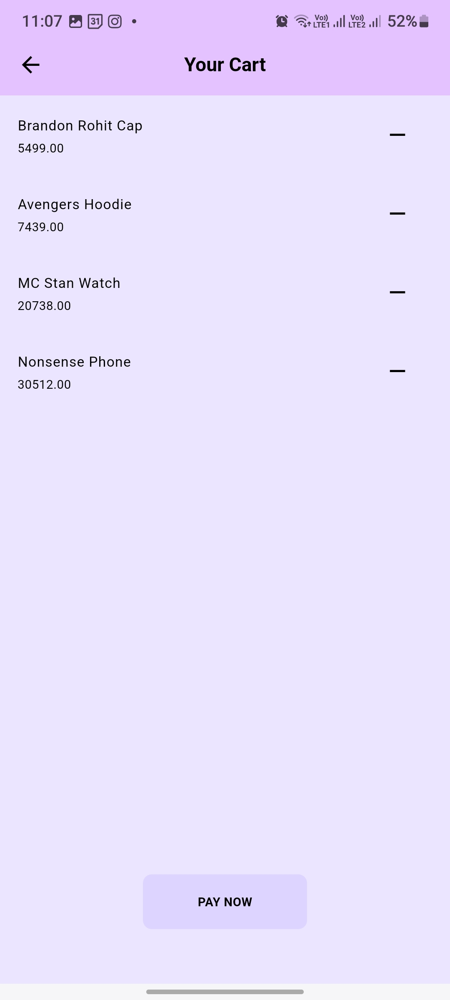
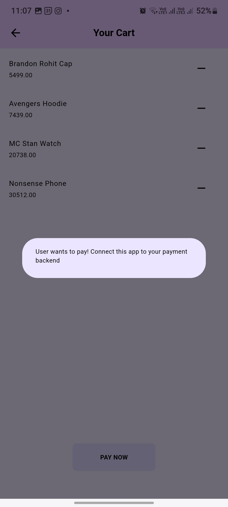

# 🛒 Flutter Ecommerce App

A minimalist and beginner-friendly **Ecommerce App** built using Flutter. Designed with clean UI and essential cart functionality, this app showcases the foundational structure of an online shopping experience — perfect for learning and showcasing your Flutter skills.

---

## 🚀 Features

- 🎯 **Minimalistic User Interface**  
- 🛍️ **Product List with Horizontal Scrolling**  
- ➕ Add items to cart  
- ➖ Remove items from cart  
- 🛒 Real-time cart view with item updates  
- 💸 **Dummy Pay Now button**  
- 📂 Menu with navigation options: **Shop**, **Cart**, and **Exit**  
- 📭 Empty cart message: `"Your cart is empty"`

---

## 📸 Screenshots

### 🏪 Home Page  
<p align="center">
  
</p>

### 🛒 Shop Page (with items)  
<p align="center">
  
</p>

### 📭 Confirmation to add item to cart Message  
<p align="center">
  
</p>

### 🏪 Cart Page (with items)  
<p align="center">
  
</p>

### 🏪 Pay Now Button Message  
<p align="center">
  
</p>

---

## 🛠️ Tech Stack

- **Flutter** (UI Framework)
- **Dart** (Programming Language)

---

## 📦 Installation

1. **Clone the Repository**
   ```bash
   git clone https://github.com/your-username/flutter_ecommerce_app.git
   cd flutter_ecommerce_app
   ```

2. **Install Dependencies**
   ```
   flutter pub get
   ```

3. **Run the App**
   ```
   flutter run
   ```

---

## ✨ Future Scope (Ideas to Expand)
🔐 Add user authentication (login/signup)

🛍️ Integrate real product data and APIs

💳 Implement payment gateway

🌙 Add Dark Mode

📱 Improve responsiveness and animations

---

## 🙌 Contributing
Contributions, ideas, and pull requests are always welcome! Let’s build and learn together.

---

📫 Contact
Connect with me on [](https://www.linkedin.com/in/pragyan-dhar-b98696313/)
or drop an email at pragyanchandradhar7@gmail.com

---

### ✅ To Do:
- Add 2–3 screenshots in `assets/screenshots/` folder.
- Replace `your-username` with your GitHub handle.
- Replace LinkedIn/email placeholders with your real links.

---

Built with 🧠, ☕, and Flutter 💙
